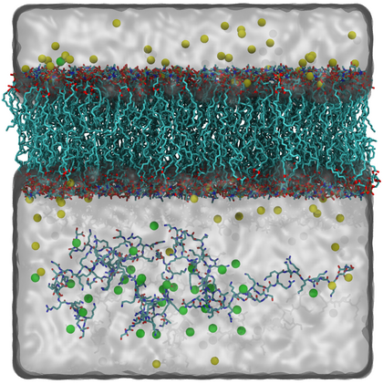
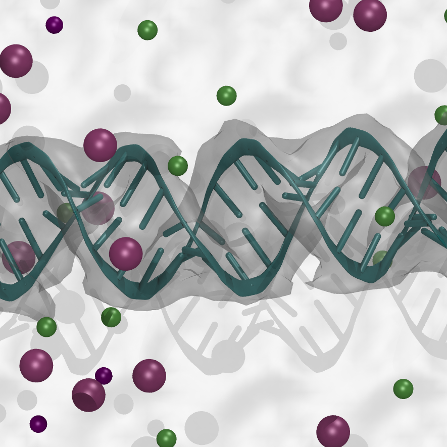

# tutorial
A collection of various tutorials for MD simulation   
1. [Protein-Bilayer-Binding](#1-protein-bilayer-binding)   
2. [RNA-Mg-Amber in Solution](#2-rna-mg-amber-in-solution)   
3. [Martini-IDP with scaling](#3-martini-idp-with-scaling)   
4. [Martini-IDP phase separation](#4-martini-idp-phase-separation)   
5. [alpha-Synu fibril](#5-alpha-synu-fibril)   

## 1. [Protein-Bilayer-Binding](./protein-bilayer-binding/README.md)   
**component:** peptide, bilayer, water, ions    
**system:** several peptides were solved in the solution of bilayer, as shown below   
 

## 2. [RNA-Mg-Amber in Solution](./RNA-Mg-Amber/README.md)
**component:** RNA, NaCl, MgCl2, water   
**system:** RNA solution with NaCl and MgCl2   
    

## 3. [Martini-IDP with scaling](./Martini_IDP/README.md)   
**component:** IDP   
**system:** IDP within scaling of original Martini force field   
    

## 4. [Martini-IDP phase separation](./Martini-idp-phase-separation/README.md)   
**component:** IDP   
**system:** IDP phase separation within scaling of Martini force field    
   

## 5. [alpha-Synu fibril](./long_fibril/README.md)   
**component:** IDP   
**system:** long fibril of alpha-synuclein simulation   
    