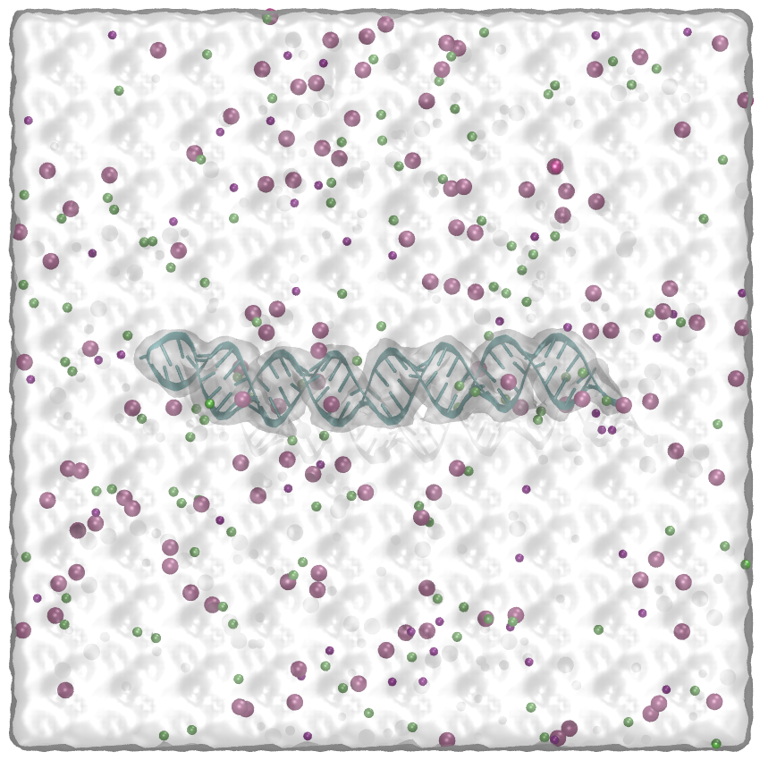

# RNA-Mg-Amber
This tutorial is for the simple simulation of RNA in solution with Mg2+   


## Dependencies
1. [pdb4amber](https://ambermd.org/tutorials/basic/tutorial9/index.php)   
2. [Charmm-GUI](https://www.charmm-gui.org/)
3. Gromacs   

## Example:
(CAG)31 RNA in water with 0.025 mM NaCl and various Mg2+, using amber ff99sb_OL15 force field, where ff99bsc0XOL3 is used for RNA    

## Flow:   
**1. prepare amber ff99sb_OL15 force field**
for RNA/DNA, the specific amber force field in Gromacs can be download from [here](https://fch.upol.cz/ff_ol/gmxOL15.php). Or you can directly use the force field files provided by Charmm-GUI.    

**2. prepare RNA pdb file**
RNA pbd file can be build through pymol or similar software. Here, for CAG31, alphafold3 was used to get the initial structure ([cag31.pdb](./examples/cag31.pdb)) in this example.   

**3. fixed pdb file**
The atom name and residue name might be inconsistent with default values in amber force field, use pdb4amber to fix it   
```
pbd4amber -i cag31.pdb -o cag31_fix.pdb
```
Actually, the fixed [cag31_fix.pdb](./examples/cag31_fix.pdb) still cannot be recognized by pdb2gmx, but Charmm-GUI can read it as input structure.   

**4. build the system**
A good way to build the RNA solution is using Charmm-GUI. Use the "Solution Builder", then upload the fixed pbd file. Keep going NEXT. In "Add Ions" section, add NaCl and MgCl2, and here, Mg2+ was select to neutralize the system.   
Also, choose the force field and output file style (Gromacs here)   