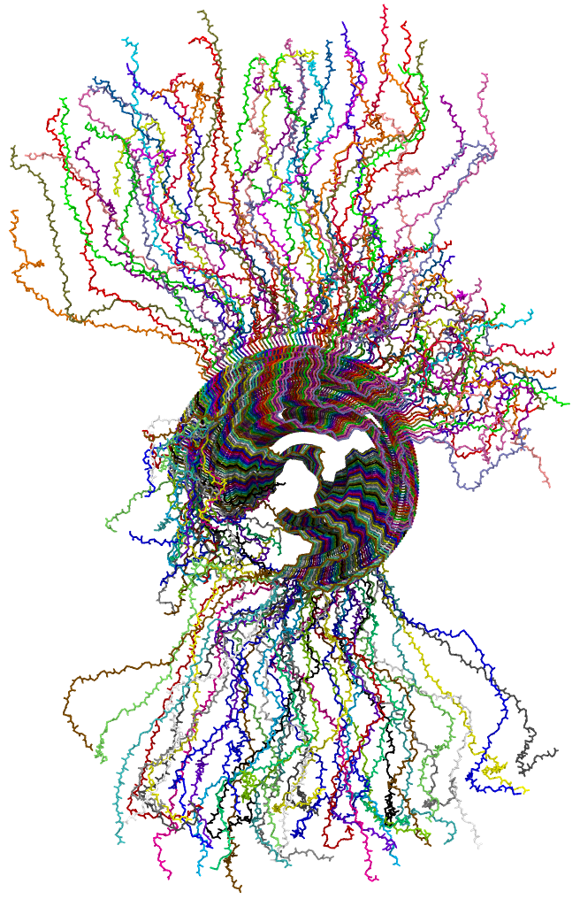
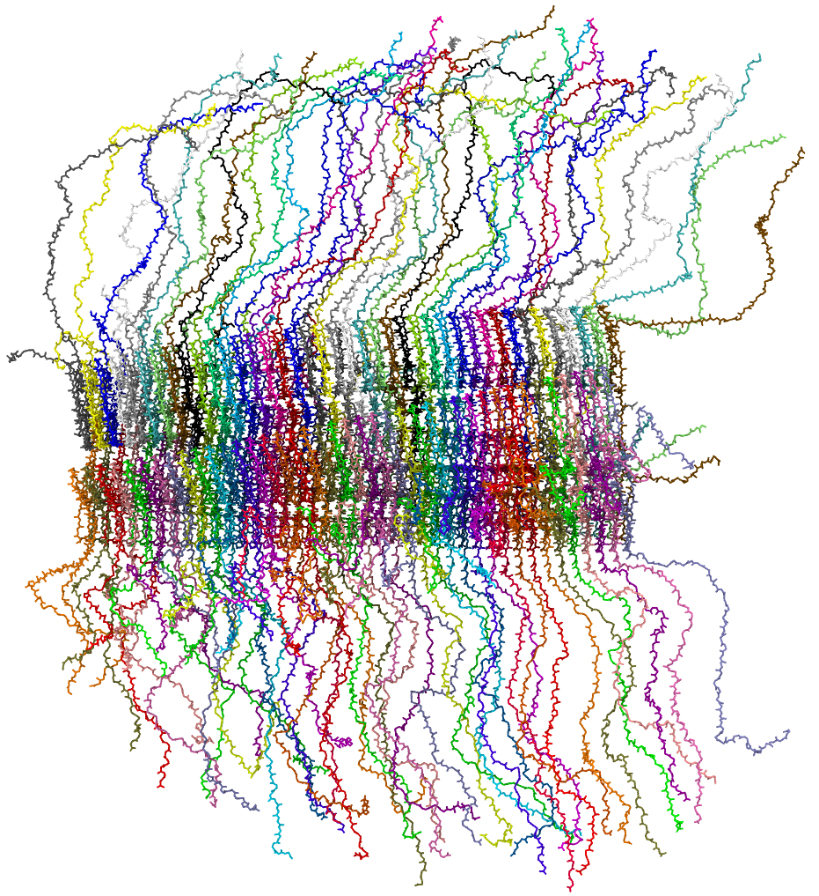

# Amyloid Fibril   
This turotial is for the simulation of long alpha-synuclein fibril (the optimized verstion of [long_fibril_2](../long_fibril_2/)), including building long fibril, runing HyRes simulation, and backmaping to all atom.   


## Dependencies:   
1. [HyresBuilder](https://github.com/lslumass/HyresBuilder/tree/er60)   
2. [cg2all](https://github.com/huhlim/cg2all)   
3. [Modeller](https://salilab.org/modeller/)   

## Example:
build a 40mer of alpha-synuclein fibril based on 6XYO.   

## Part A. build long fibril:
1. download 6xyo pdb file ([6xyo.pdb](./examples/6xyo.pdb)) and 6xyo monomer sequence fasta file([6xyo.fasta](./examples/6xyo.fasta)):   
```wget www.rcsb.org/pdb/files/6xyo.pdb```     
```wget -O 6xyo.fasta www.rcsb.org/fasta/entry/6xyo/download```   
2. build longer fibril core using [build_long_fibril_v2.py](./scripts/build_long_fibril_v2.py)   
```python build_long_fibril_v2.py -i 6xyo.pdb -n 40 -o 40mer.pdb```   
the 40-layer fibirl will be built ([40mer.pdb](./examples/40mer.pdb)).   
3. fill in the missing residues using Modeller, followd by performiong a very-fast level refinement   
```python add_missing_residues_v3.py 6xyo.fasta 80```    
here, 80 is tatol number of monomers (40 layers, 80 monomers)   
ignore any error message if you get the pdb file named 'fill.B*******1.pdb', it was renamed as [40mer_fill.pdb](./examples/40mer_fill.pdb) here.    
4. add hydrogens and convert [40mer_fill.pdb](./examples/40mer_fill.pdb) to charmm-style [40mer_fill_charmm.pdb](./examples/40mer_fill_charmm.pdb) using cg2all.   
**Note:** if you get CUDA memory error, try: ```export PYTORCH_CUDA_ALLOC_CONF=max_split_size_mb:128```   

## Part B. Convert to HyRes model   
1. Convert all atom structure to HyRes   
```convert2cg 40mer_fill_charmm.pdb 40mer_hyres.pdb -t charged```   
-t defines the terminal charge status: neutral or charged;   
a psf file will also be created named following output pdb file [40mer_hyres.psf](./examples/40mer_hyres.psf)   
2. run HyRes simulation   
follow the details in [HyresBuilder](https://github.com/lslumass/HyresBuilder/tree/er60)   

## Part C. Backmap to all-atom
After HyRes simulation finished, we might need to backmap HyRes structure or trajectory to all atom structure.    
This is done by [cg2all](https://github.com/huhlim/cg2all). For large trajectory, follow [backmap_traj.py](./scripts/backmap_traj.py) as reference.    
