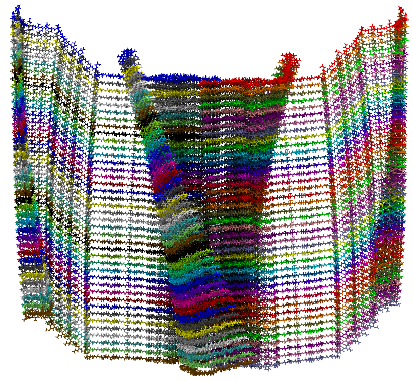
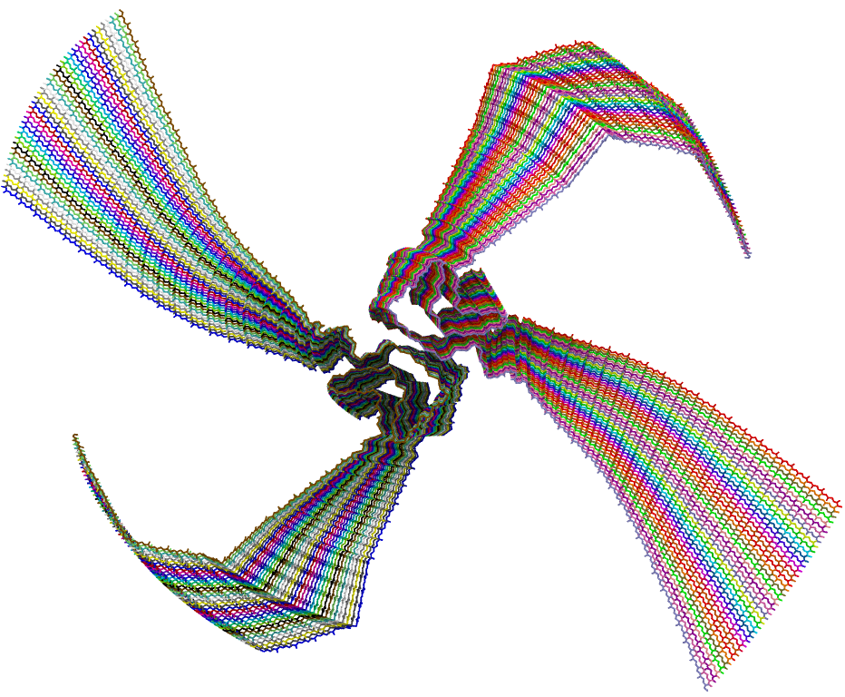

# long_fibril   
This turotial is for the simulation of long alpha-synuclein fibril.   


## Dependencies:   
1. [HyRes force field](https://github.com/lslumass/HyRes_GPU/tree/dev)   
2. [CHARMM-GUI](https://www.charmm-gui.org/)   
3. [Modeller](https://salilab.org/modeller/)   

## Example:
build a 40mer of alpha-synuclein fibril based on 6OSJ.   

## Flow:
**1. prepare fibril model with filled missing loops**   
a. download 6osj pdb file ([6osj.pdb](./examples/6osj.pdb)):   
```wget www.rcsb.org/pdb/files/6osj.pdb```   
b. download 6osj monomer sequence fasta file ([6osj.fasta](./examples/6osj.fasta)):   
```wget -O 6osj.fasta www.rcsb.org/fasta/entry/6osj/download```   
c. fill in the missing residues using Modeller:    
```python fill_missing_residues_v2.py 6osj.fasta 10```   
>**Note:** 10 means 6osj.pdb contains 10 copies of monomer. [fill_missing_residues_v2.py](./scripts/fill_missing_residues_v2.py) first creates [alignment.ali](./examples/alignment.ali), and then call Modeller.AutoModel to fill in the missing residues without any refinement. After this, we will get a pdb file named as fill.********.pdb. Here, it was renamed as [6osj_fill.pdb](./examples/6osj_fill.pdb).   


d. convert [6osj_fill.pdb](./examples/6osj_fill.pdb) to charmm-style using [CHARMM-GUI](https://www.charmm-gui.org/).   
**Note:** select "None" for all the ternimus, select "CHARMM PDB" to download. Rename the obtained pdb file as [6osj_fill_charmm.pdb](./examples/6osj_fill_charmm.pdb)   
e. fix poteintial errors in the pdb file:   
```python pbdfix_res.py 6osj_fill_charmm.pdb 6osj_fill_charmm_fix.pdb 0```   


**2. build longer fibril**   
```python build_long_fibril_v3.py 6osj_fill_charmm_fix.pdb 40mer.pdb 40```   
>Here, 40 is total layers of dimers in the fibril, [40mer.pdb] is built long fibril, where each monomer was assigned a segment name with P*.    


**3. build HyRes model and run simulation**   
For this part, following the [HyRes tutorial](https://github.com/lslumass/HyRes_GPU/tree/dev).   