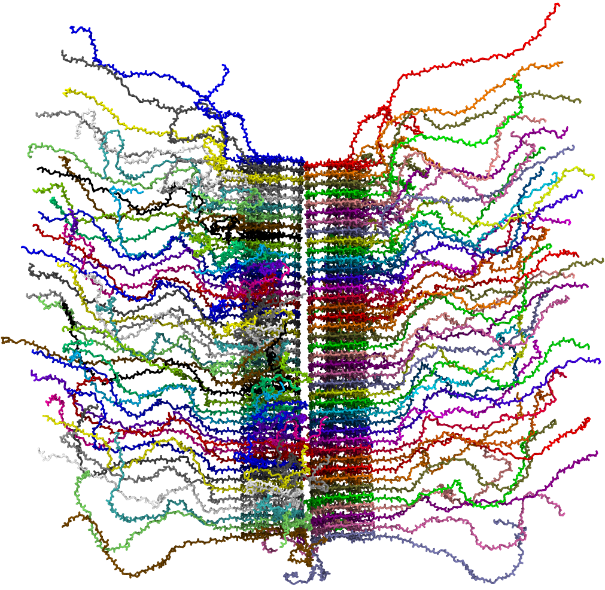
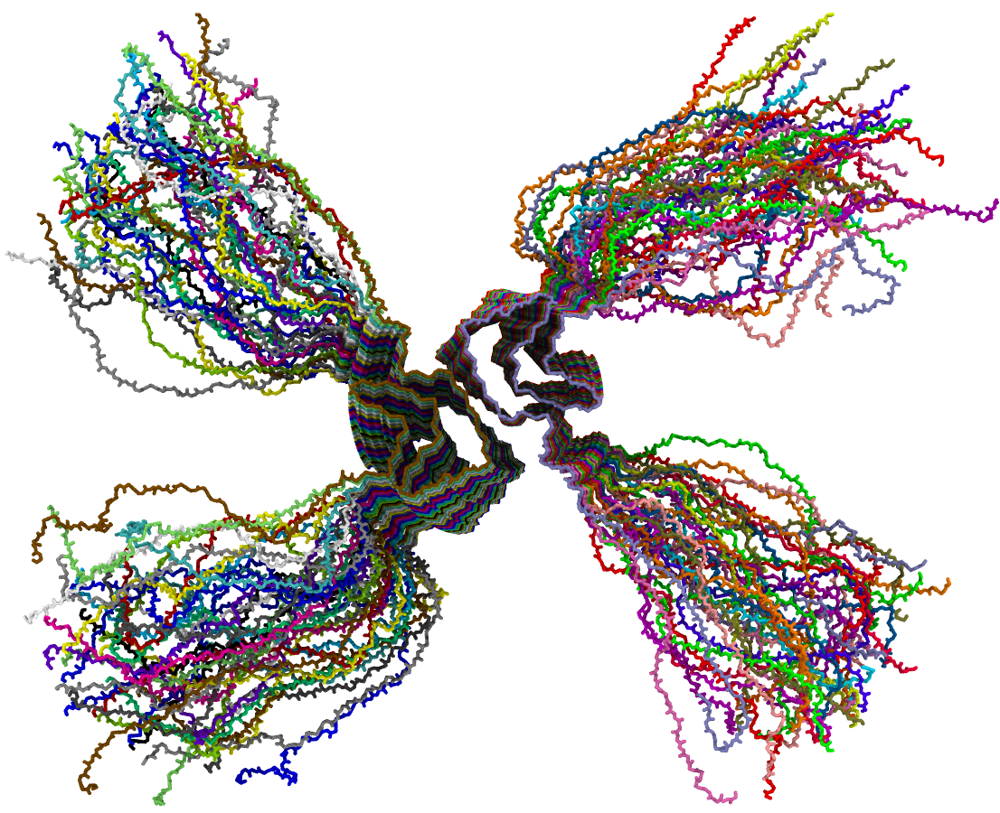
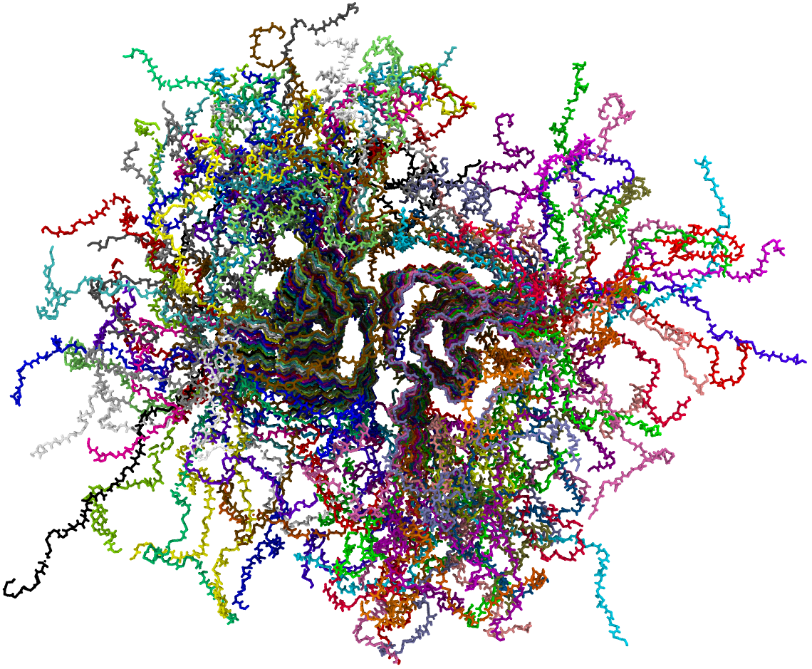
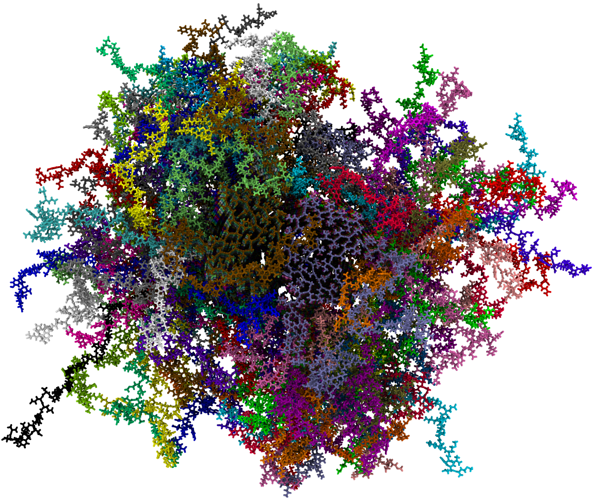

# long_fibril_2   
This turotial is for the simulation of long alpha-synuclein fibril (the optimized verstion of [long_fibril](../long_fibril/)).   


## Dependencies:   
1. [HyRes force field](https://github.com/lslumass/HyRes_GPU/tree/dev)   
2. [CHARMM-GUI](https://www.charmm-gui.org/)   
3. [Modeller](https://salilab.org/modeller/)   

## Example:
build a 40mer of alpha-synuclein fibril based on 6OSJ.   

## Flow:
a. download 6osj pdb file ([6osj.pdb](./examples/6osj.pdb)) and 6osj monomer sequence fasta file([6osj.fasta](./examples/6osj.fasta)):   
```wget www.rcsb.org/pdb/files/6osj.pdb```     
```wget -O 6osj.fasta www.rcsb.org/fasta/entry/6osj/download```   
b. build longer fibril core using [build_long_fibril_v2.py](./scripts/build_long_fibril_v2.py)   
```python build_long_fibril_v2.py -i 6osj.pdb -n 40 -o 40mer.pdb```   
the 40-layer fibirl will be built ([40mer.pdb](./examples/40mer.pdb)).   
c. fill in the missing residues using Modeller, followd by performiong a very-fast level refinement   
```python add_missing_residues_v3.py 6osj.fasta 80```    
here, 80 is tatol number of monomers (40 layers, 80 monomers)   
ignore any error message if you get the pdb file named 'fill.B*******1.pdb', it was renamed as [40mer_fill.pdb](./examples/40mer_fill.pdb) here.    
d. convert [40mer_fill.pdb](./examples/40mer_fill.pdb) to charmm-style using [CHARMM-GUI](https://www.charmm-gui.org/).   
**Note:** use default "NTER/CTER" for all the ternimus, select "CHARMM PDB" to download. Rename the obtained pdb file as [40mer_fill_charmm.pdb](./examples/40mer_fill_charmm.pdb)   
e. fix poteintial errors in the pdb file:   
```python pbdfix_res.py 40mer_fill_charmm.pdb 40mer_fill_charmm_fix.pdb 0```   

f. build HyRes model and run simulation    
Briefly:   
```
python at2hyres.py 40mer_fill_charmm_fix.pdb 40mer_hyres.pdb
python psfgen_hyres.py -i monomer_hyres.pdb -n 80 -o conf.psf
packmol < pack.inp
python run.py -b 50
```
For details, follow the [HyRes tutorial](https://github.com/lslumass/HyRes_GPU/tree/dev).   


## Back to all-atom
After HyRes simulation finished, we might need backmap it to all atom structure to run atomistic simulation.   

1. Backmap   
Save out the structure but backbone only [fibril_hyres_producted.pdb](./examples/fibril_hyres_producted.pdb). Then, use Charmm-GUI to rebuild the atomistic structure [fibril_all_atom.pdb](./examples/fibril_all_atom.pdb).   
2. Replace the core region   
The fibril core region would be different with crystal structure, which might make the all-atom simulation unstable. So, we can replace the coordinates of fibril core with crystal structure, using [replace_coordinates.py](./scripts/replace_coordinates.py)   
```python replace_coordinates.py 40mer_fill_charmm_pdb fibril_all_atom_replaced.pdb```
3. run all-atom simulation   
Use monomer pdb file to create itp file and run Gromacs simulation